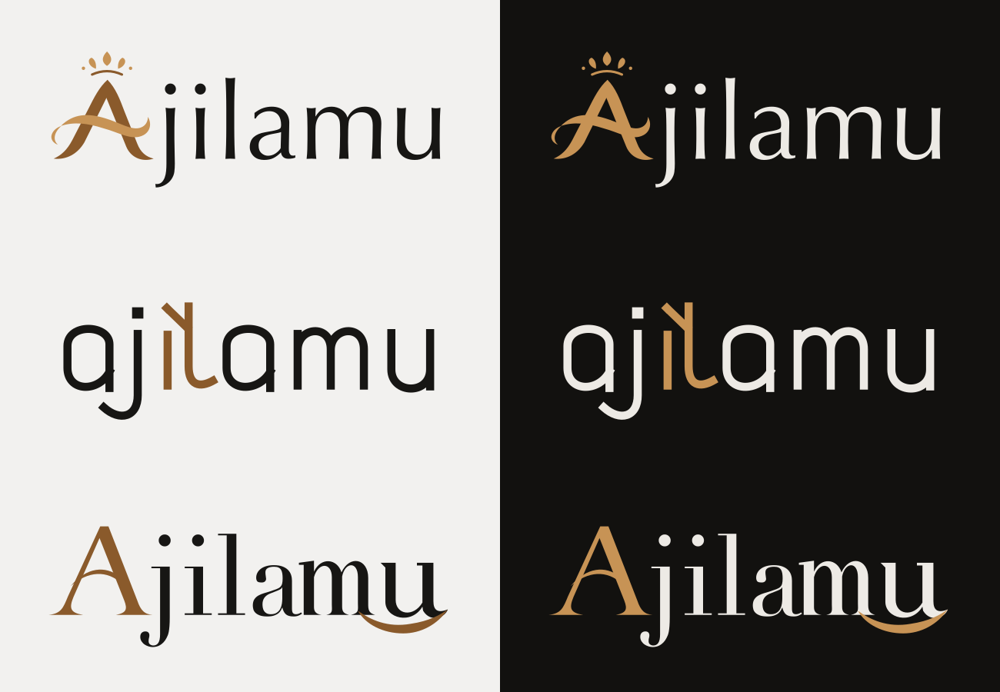

# Ajilamu wordmarks

Three designs each include a transparent SVG for light and dark surfaces.
Every letter uses vector geometry and needs no installed font.

| Design | Light surface | Dark surface |
|---|---|---|
| Original | [SVG](original-light.svg) | [SVG](original-dark.svg) |
| Woven | [SVG](woven-light.svg) | [SVG](woven-dark.svg) |
| Theatrical | [SVG](theatrical-light.svg) | [SVG](theatrical-dark.svg) |

Original integrates the decorated crown and ribbon A as the first letter of Ajilamu.
Woven uses custom lowercase geometry with a folded i and l pairing.
Theatrical combines sculpted lettering with a sweeping m and u finish.

Use light files on pale surfaces and dark files on dark surfaces.
Light files use ink `#171614` and bronze `#8a5a2b`, with amber `#c79355` in the original design.
Dark files use warm white `#edeae5` and amber `#c79355`.

All six wordmarks have transparent backgrounds.
The [comparison SVG](comparison.svg) and [comparison PNG](comparison.png) include presentation backgrounds for reviewing both modes.
